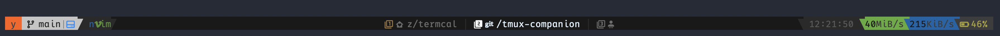
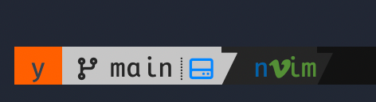
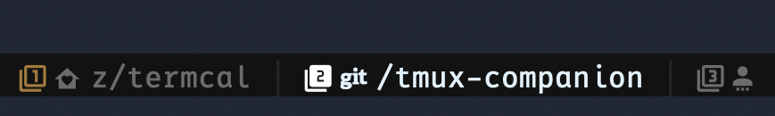
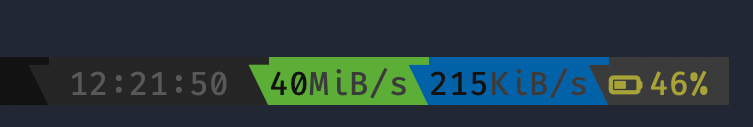

# tmux-companion

_Status bar_



_Left_



_Middle_



_Right_



---

A single self-contained Rust binary that replaces a collection of shell scripts
and a Go tool (`yrl gst`) used to drive tmux status-line segments.

Instead of spawning six short-lived processes every second, tmux-companion runs
as a persistent background daemon. Each tmux refresh sends a lightweight JSON
request over a Unix socket and prints the result — no process startup overhead,
no re-reading config files, no repeated disk I/O.

**Requires font with nerdfonts glyphs**

## Segments

| Subcommand           | Replaces                      | What it shows                                                 |
| -------------------- | ----------------------------- | ------------------------------------------------------------- |
| `gst [PATH]`         | `yrl gst`                     | Powerline git-status segment                                  |
| `window …`           | `window-status.zsh`           | Window index icon, abbreviated path, process dot, alert flags |
| `battery`            | `battery-life.zsh`            | Battery percentage and icon (macOS)                           |
| `net`                | `net-monitor.zsh`             | Download / upload bandwidth                                   |
| `clients <sa> <wac>` | `check-clients.zsh`           | Other tmux clients connected to the same server               |
| `vim-bg <pid>`       | `check-vim-in-background.zsh` | Suspended nvim in current pane                                |

All subcommands speak to the same daemon; only `server` starts the daemon itself.

## Quick start

```sh
cargo build --release
sudo mv target/release/tmux-companion <some-dirctory-in-your-PATH>

# Manual smoke test
tmux-companion server &         # auto-started by clients, but you can start it explicitly
tmux-companion gst              # git status for current directory
tmux-companion battery
```

## tmux.conf integration

Replace the existing shell-script `#(…)` calls with `tmux-companion`:

```tmux
set -g  status-left  "#[fg=#{@theme-session-name-fg},bg=#{@theme-session-name-bg}] #S \
#(tmux-companion clients #{session_attached} #{window_active_clients})\
#(tmux-companion gst #{pane_current_path})"
set -ga status-left  "#(tmux-companion vim-bg #{pane_pid})#[fg=colour235,bg=colour233]"

set -g  status-right "#[fg=colour235,bg=colour233]#[fg=colour240,bg=colour235] %H:%M:%S"
set -ga status-right " #(tmux-companion net)#[fg=color237]#[bg=colour237]#(tmux-companion battery) "

set -g  window-status-current-format \
  "#(tmux-companion window -c -i #I -n '#W' -w '#{pane_current_path}' \
     -p '#{pane_current_command}' -s '#{pane_start_path}' -I #{window_id} -f '#{window_flags}' \
     -P #{window_panes} -A #{pane_index})"
set -g  window-status-format \
  "#(tmux-companion window -i #I -n '#W' -w '#{pane_current_path}' \
     -p '#{pane_current_command}' -I #{window_id} -f '#{window_flags}' \
     -P #{window_panes} -A #{pane_index})"
```

`-P` / `-A` add a numeric-circle suffix with the active pane index, shown only
when the window holds more than one pane.

## The `gst` segment in detail

```sh
tmux-companion gst [PATH] [-f]
```

- `PATH` defaults to the current pane directory (`#{pane_current_path}`).
- `-f` / `--force` — bypass the 2-second SQLite cache and fetch a fresh status.
  Useful for a keybinding that refreshes on demand.
- Outputs an empty string for non-git directories (safe to use everywhere).

Segment anatomy (left → right):

```
 <remote-ok/fail/loading>  <branch-type-icon> <branch-name>  <ahead↑ behind↓ unmerged>  <unstaged>  <staged>  <stash>
```

Background colours change with repo state:

| State                  | Colour           |
| ---------------------- | ---------------- |
| Clean                  | Green (120)      |
| New branch             | Light grey (251) |
| Gone upstream          | Dark red (088)   |
| Dirty / ahead / behind | Orange (209)     |

## Server lifecycle

The daemon starts automatically when any client subcommand is invoked and no
server is listening on the socket yet. It runs until the system restarts or
until it is killed explicitly. Because it lives inside the user's tmux session
lifetime, no init-system integration is needed.

Socket: `/tmp/tmux-companion-<uid>.sock`

## Building

Requires Rust 1.82+ (edition 2024). SQLite is bundled — no system library
needed.

```sh
cargo build --release
```

Binary: `target/release/tmux-companion` (≈ 5.4 MB, statically-linked SQLite).

## Tests

```sh
cargo test          # 164 unit tests, no external dependencies required
```
